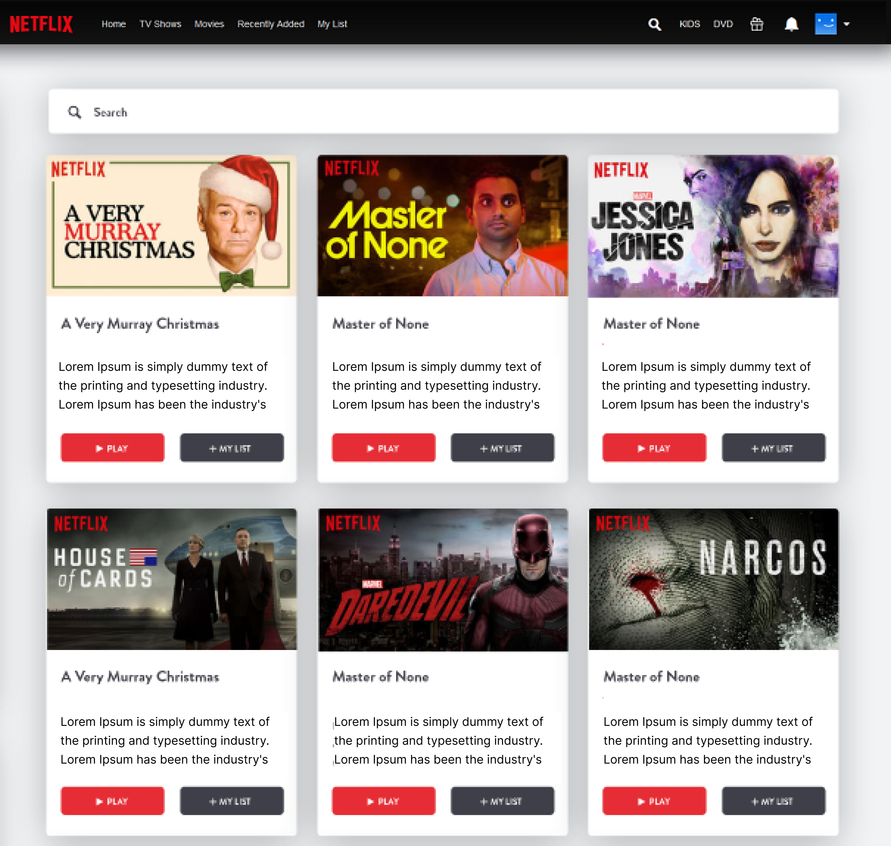

# React Component Workshop

We'll use our knowledge of React to start building a clone of the Netflix UI.

## Task 1 - Building Blocks of React

**1.1:**

👉 This repo has the React app already created within it. You just need to install the Node modules. (If you forget the terminal command to do this, you can always Google it.)

**1.2:**

👉 Either use https://miro.com/ or figma or install the extension draw.io and create a Ui hierachy breaking down the components of the image below into individule components

For a reminder of how to break down a UI, [click here](https://beta.reactjs.org/learn/thinking-in-react#:~:text=Now%20that%20you%E2%80%99ve%20identified%20the%20components%20in%20the%20mockup%2C%20arrange%20them%20into%20a%20hierarchy).

   
  <!-- check images folder for the image -->

---

 
 

## Task 2 - Creating Components

**1.1:**

👉 Build a re-useable component:

- Create a new folder inside of the components folder and call it `Card`.
- Inside the `Card` folder Create a new file called index.js.
- Inside index.js create a functional component that returns a JSX div.
- Add a className `className="card"` to the JSX as there is a class allready applied to it in App.css (you can customize the CSS if you have time!).

👉 Navigate back to [App.js](./src/App.js). As you know this will be where all of our components are going to live.

- Import and call the `Card` component inside the app component.
- Try adding the Card component mulitple times to get multiple cards displaying, at least 6 of them.

---

 
 

## Task 3 - Nested Components

**3.1:**

👉 Create a button component and nest it inside of the Card Component

- Create a new folder inside of the components folder and call it `Button`.
- Inside the `Button` folder, create a new file called index.js.
- inside index.js create a functional component that returns a JSX button with the word `Play` inside.
- Add the Button component to your card component **twice** too look like the nextflix image from earlier.
- Add a className `className="Button"` to the button. This time, create a Button.css file inside of your Button folder.
- Import the Button.css into the index.js Button component
- Add some styling to your button using the CSS file.

**3.2:**

- if you complete the above add a Card.css to the Card folder and apply some styling to your Card component.

---

 
 

## Task 4 - Using Props

**4.1:**

👉Now that we know we can change the data we put into our components with props, go back to the Card component and add more elements to the JSX. Remember, React can only render one parent element from a component, so all JSX elements in your component must have a common parent. Then try to add props for each of the below from your app.js into your `<Card />` component:

- A title :

  `<h3> props goes here </h3>`

- text description :

  `
 props goes here 
`

- An Image :

  ``

Make sure that each prop is different in each element, here are a few urls for the img element prop, feel free to find and copy your own image address's

- `"https://i.ytimg.com/vi/hHwblpw3grg/maxresdefault.jpg"`
- `"https://pbs.twimg.com/profile_images/1567967620971765762/I0RjsOzO_400x400.jpg"`
- `"https://pbs.twimg.com/media/FI5tl66XwAI7vYW.jpg"`
- `"https://www.birminghamupdates.com/wp-content/uploads/2020/07/IMG_7540-scaled-e1594894273443.jpg"`

**4.2:**

👉 Pass two more props called buttonText1 & buttonText2 into each `<Card />` component in app.js, then the same props again into the `<Button/>` components props in Card/index.js . This is know as prop drilling when you pass data from one components props to another components props.

- for the first buttons text prop add `Play`
- for the second buttons text prop add `+my list`

  `<Button text={ first prop goes here }/>`

  `<Button text={ second prop goes here }/>`

👉 Bonus ⭐ : Once again if you finish task 4 go a ahead and style your components to how you like them

---

 
 

## Task 5 - Conditional Rendering

**5.1:**

👉 For your next task create a folder/file called LogginButton/index.js with a functional component called LogginButton which takes in a boolean prop called `isLoggedIn`

- if isLoggedIn is true render `<Button text="Sign-out" />`, using an if statement
- if isLoggedIn is false render `<Button text="Login" />`, using an else statement

Remember to put your `<LogginButton isLoggedIn={true} />` component inside your app.js to render it.

**5.2:**

👉 inside your Card component on the img elements `src` attribute use a Ternary operator to display either two images.

If there is an img prop passed in then render it

If there is not an img prop passed in then render the below string:

- `"https://img.freepik.com/free-vector/glitch-error-404-page_23-2148105404.jpg"`

**5.3:**

👉 You can also use the Ternary operator to change styling on an element, give it a go on some of your elements using props , for example:

- `<h1 style={{ color: props.hasColor ? "red" : "black" }}> im green now </h1> `

---

 

## Bonus-1 ⭐ :

- Go back to task one where we broke down the Netflix UI and try to recreate each component. There is a movie list folder in the components folder which contains a list of data and images to use. You can import the movies array of object's and use dot notation to pass the infomation needed to each card component, feel free to add more titles to the array.
- Style it as best as you can to imitate Netflix's UI.
- Feel free to build your own custom component's.
- There are also plenty of npm packages out there that you could use, here are a recommended few
  - [React Icons](https://react-icons.github.io/react-icons)
  - [React Styled Components](https://styled-components.com/)
  - [React Bootstrap](https://react-bootstrap.github.io/components/spinners/)

---

## Bonus-2 ⭐ :

- If you mannage to finish bonus task 1 either create a new react app and try to clone the [BBC](https://www.bbc.co.uk/) app to get a better idea of how much components are used or research into the following items.

1. [Batching](https://blog.bitsrc.io/automatic-batching-in-react-18-what-you-should-know-d50141dc096e)
2. [Transitions](https://blog.shahednasser.com/how-to-use-transitions-in-react-18/)
3. [Suspense](https://17.reactjs.org/docs/concurrent-mode-suspense.html#:~:text=Next%20Steps-,What%20Is%20Suspense%2C%20Exactly%3F,-Suspense%20lets%20your)
4. [Hooks](https://betterprogramming.pub/5-new-hooks-in-react-18-300aa713cefe)
